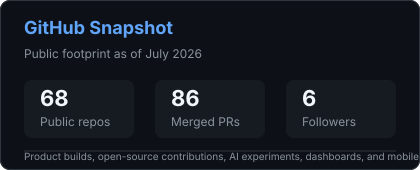
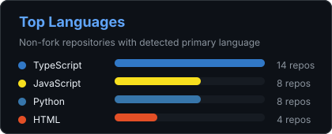

# Rishav Dewan

### Product-focused builder working across Indian consumer tech, agentic AI, and full-stack product execution.

I turn product questions into shipped software: problem framing, UX systems, backend architecture, release gates, security checks, and the last mile of polish that makes a product feel real.

---

## Builder Thesis

I am interested in products where the user problem is specific, the workflow is messy, and the solution needs both product taste and engineering depth.

My default operating loop:

| Principle | How it shows up in my work |
|---|---|
| Start with a sharp user problem | I define the pain, the user segment, the current workaround, and the metric before I write code. |
| Ship the smallest credible product | I prefer working demos, staged milestones, and release gates over endless concept work. |
| Design for trust | Especially in tax, finance, food, and personal contexts, I build clear states, safe defaults, error handling, and auditability. |
| Treat product polish as infrastructure | Motion, empty states, onboarding, copy, and responsiveness are part of the system, not decoration. |
| Contribute in the open | I work on public repositories, submit PRs to maintained projects, and learn through real review cycles. |

Currently building and experimenting around **Arthakram**, applied AI workflows, and products for Indian users.

---

## Product Portfolio

### Flagship Builds

| Product | Product bet | What I built | Stack |
|---|---|---|---|
| [**ARTH**](https://github.com/rish106-hub/ARTH) | Salaried Indians overpay taxes because deductions, documents, and filing decisions are scattered across too many places. | India's first tax gap intelligence app with a Tax OS cockpit, trust-first onboarding, encrypted document vault, accuracy coach, backend security hardening, release readiness gates, and production reliability work. |    |
| [**Gitdoc**](https://github.com/rish106-hub/gitdoc) | Developers using VS Code and Cursor need plain-English Git recovery when the repo state becomes scary. | A VS Code extension concept for Git rescue flows: explain the state, suggest the safest recovery path, and reduce panic during common Git mistakes. |   |
| [**EatRight**](https://github.com/rish106-hub/EatRight) | Dinner planning should start from what is already at home, then add the smallest useful item from Swiggy Food or Instamart. | MCP-powered dinner assistant with deterministic planner, read-only provider stubs, shared contracts, recommendation UI, health checks, staged issues, security invariants, accessibility tasks, and product specs. |    |
| [**Raaz**](https://github.com/rish106-hub/Raaz) | Indian Gen Z needs lower-pressure ways to have meaningful conversations without profile-first social mechanics. | Anonymous, prompt-based 20-minute conversation platform with structured emotional dialogue and full-stack app execution. |    |
| [**CostSense**](https://github.com/rish106-hub/CostSense) | Enterprise spend teams need anomaly detection tied to financial impact, not another passive dashboard. | Autonomous cost intelligence system with a 9-agent AI pipeline that detects spend anomalies, scores impact, and recommends action. |   |
| [**Lovlet**](https://github.com/rish106-hub/Lovlet) | Couples need a tiny shared ritual that feels personal without becoming another heavy social app. | Widget-first couples app for sharing a selfie and short note as the partner's latest home-screen moment. |   |

### Additional Shipped Experiments

| Project | Focus | Link |
|---|---|---|
| **Leadline** | WhatsApp lead capture into Google Sheets for lightweight sales workflows. |  |
| **NEET Counselling** | Guidance tool for 22 lakh+ NEET aspirants figuring out next steps. |  |
| **Swiggy Builders Club** | AI household orchestrator coordinating Food, Instamart, and Dineout agents. |  |
| **Orbit Calendar** | Agentic calendar concept for organizing schedules and execution. |  |
| **ATS Prompt Lab** | Resume shortlisting PoC with transparent scoring, local PDF parsing, and token tracking. |  |
| **Chat Context Bridge** | Chrome extension concept for preserving LLM conversation context across ChatGPT, Claude, and Gemini. |  |
| **Panchayat** | Agentic housing society management tool. |  |
| **Blinkit Analysis** | Tableau business intelligence dashboard across sales, delivery, inventory, and marketing data. |  |
| **Uber Dashboard** | Tableau dashboard analyzing 721 Uber trips for driving and revenue patterns. |  |

---

## Product Craft Signals

These are the kinds of product details I care about and repeatedly build into my projects:

| Area | Evidence from recent builds |
|---|---|
| Onboarding and activation | Trust-first onboarding in ARTH, M0 onboarding flow in EatRight, pre-registration experience for Lovelet. |
| Reliability and safety | Backend rate limiting, security storage hardening, release readiness gates, safe read-only demo modes, provider failure handling. |
| UX systems | Premium frontend primitives, document vault redesign, recommendation cards, skeleton states, responsive mobile checks. |
| Product operations | Roadmaps, issue-backed milestones, state-machine docs, acceptance tests, health endpoints, CI gates, audit notes. |
| User context | Indian tax workflows, Swiggy meal decisions, NEET counselling, Gen Z social conversations, WhatsApp-led sales capture. |

---

## Open Source Contributions

I contribute to open-source projects where the feedback loop is real: maintainers review the change, edge cases matter, and quality has to survive outside my own repo.

| Project | Domain | Contribution themes | Representative PRs |
|---|---|---|---|
|  | Creative coding education | Runtime stability, null guards, memory leaks, strict equality, audio/math edge cases, canvas behavior. | [#7741](https://github.com/sugarlabs/musicblocks/pull/7741), [#7740](https://github.com/sugarlabs/musicblocks/pull/7740), [#7583](https://github.com/sugarlabs/musicblocks/pull/7583), [#7540](https://github.com/sugarlabs/musicblocks/pull/7540), [#7539](https://github.com/sugarlabs/musicblocks/pull/7539) |
|  | Data visualization | Dashboard theming and design-token consistency. | [#41731](https://github.com/apache/superset/pull/41731) |
|  | Open-source CRM | Email settings behavior and product workflow fixes. | [#21853](https://github.com/twentyhq/twenty/pull/21853) |
|  | Secure communications | Livechat UX, notification behavior, search indexing, permissions, settings documentation. | [#40945](https://github.com/RocketChat/Rocket.Chat/pull/40945), [#40928](https://github.com/RocketChat/Rocket.Chat/pull/40928), [#40887](https://github.com/RocketChat/Rocket.Chat/pull/40887), [#40874](https://github.com/RocketChat/Rocket.Chat/pull/40874) |
|  | Team chat | Search relevance and user suggestion ranking. | [#39588](https://github.com/zulip/zulip/pull/39588) |
|  | Content management | Backend authorship logic and module behavior fixes. | [#48014](https://github.com/joomla/joomla-cms/pull/48014), [#47966](https://github.com/joomla/joomla-cms/pull/47966) |
|  | Food marketplace SaaS | Admin portal, payment integration, CORS/auth fixes, error handling, README architecture. | [#10](https://github.com/SayAn1-dls/Tomato-ts/pull/10), [#9](https://github.com/SayAn1-dls/Tomato-ts/pull/9), [#8](https://github.com/SayAn1-dls/Tomato-ts/pull/8), [#7](https://github.com/SayAn1-dls/Tomato-ts/pull/7) |

Public GitHub footprint as of July 2026: **68 repositories**, spanning product builds, open-source forks, AI experiments, dashboards, mobile apps, and learning archives.

---

## Writing and Product Thinking

I write about business models, product strategy, and market shifts in Indian consumer tech. The goal is to understand how products win beyond the interface: distribution, trust, pricing, retention, and behavior change.

| Essay | Theme |
|---|---|
| [ Beyond the 10-Minute Delivery: 5 Counter-Intuitive Truths Reshaping Indian Retail](https://medium.com/@rishavdewan10) | Quick commerce, retail behavior, and operating models. |
| [ Breaking Down PW: Building a Billion-Dollar EdTech Empire in Bharat](https://medium.com/@rishavdewan10) | Bharat edtech, trust, affordability, and distribution. |
| [ How Kuku FM Unlocked India's Vernacular Audio Market](https://medium.com/@rishavdewan10) | Vernacular content, habit formation, and audio subscriptions. |
| [ Decoding Meesho's Ultra-Efficient, Merchant-First Strategy](https://medium.com/@rishavdewan10/decoding-meeshos-ultra-efficient-merchant-first-strategy-c9ecbb640816) | Marketplace efficiency, merchant-first strategy, and brand repositioning. |

**Read more:** [medium.com/@rishavdewan10](https://medium.com/@rishavdewan10)

---

## Stack

| Languages | Frontend and Mobile | Backend and Data | Product Tooling |
|---|---|---|---|
|        |      |      |      |

 

---

## GitHub Activity

 
 

---

**I build products end to end: insight, interface, system, launch, iteration.**

